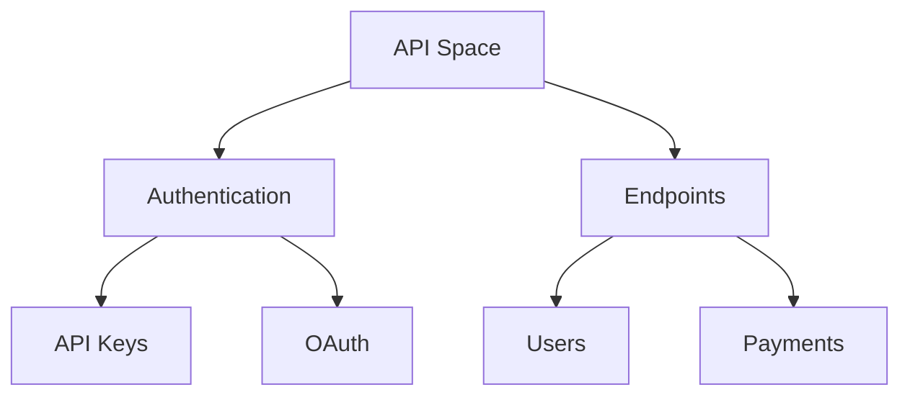

## Overview

Ginjou provides a flexible documentation management system where you organize content into spaces, projects, and versions. You build effective workflows by understanding spaces for hierarchy, project structures for versioning, collaboration models for team access, and best practices for content organization. These concepts form the foundation for scaling your documentation.

## Key Concepts

<Columns cols={2}>
  <Card title="Spaces & Hierarchy" icon="layers" href="#spaces-hierarchy">
    Organize docs into nested spaces for logical grouping.
  </Card>
  <Card title="Projects & Versioning" icon="git-branch" href="#projects-versioning">
    Manage multiple versions per project with branching.
  </Card>
  <Card title="Collaboration" icon="users" href="#collaboration">
    Control access with roles and permissions.
  </Card>
  <Card title="Best Practices" icon="check-circle" href="#best-practices">
    Structure content for discoverability and maintenance.
  </Card>
</Columns>

## Documentation Spaces and Hierarchy

Spaces act as top-level containers in Ginjou. You create a space for each major documentation area, such as "API Reference" or "User Guides". Within spaces, you define a hierarchy using folders and pages.

This structure ensures intuitive navigation. For example, a public API space might include:



<Callout kind="tip">
  Start with broad spaces and refine hierarchy as your docs grow. Limit depth to three levels for usability.
</Callout>

## Project Structures and Versioning

Projects group related documentation with built-in versioning. You initialize a project in a space, then create branches for versions like `v1.0` or `stable`.

Use this YAML structure in your project config:

<CodeGroup tabs="YAML,JSON">
  ```yaml
  project:
    name: "api-docs"
    versions:
      - stable
      - v2.0
      - v1.5
    default: stable
  structure:
    - folder: endpoints
      pages:
        - users.mdx
        - payments.mdx
  ```
  ```json
  {
    "project": {
      "name": "api-docs",
      "versions": ["stable", "v2.0", "v1.5"],
      "default": "stable"
    },
    "structure": [
      {
        "folder": "endpoints",
        "pages": ["users.mdx", "payments.mdx"]
      }
    ]
  }
  ```
</CodeGroup>

Versioning keeps docs current without breaking legacy references. Switch versions via `https://docs.example.com/{space}/{project}/{version}/page`.

## Collaboration and Permissions Model

Ginjou uses role-based access control (RBAC). Assign roles at space or project levels.

<Tabs>
  <Tab title="Admin" icon="shield">
    Full access: edit, publish, manage users.
  </Tab>
  <Tab title="Editor" icon="edit-3">
    Edit and review content, no user management.
  </Tab>
  <Tab title="Viewer" icon="eye">
    Read-only access to published docs.
  </Tab>
</Tabs>

<Expandable title="Advanced Permissions" default-open="false">
  Use granular permissions for folders:

  | Resource | Admin | Editor | Viewer |
  |----------|-------|--------|--------|
  | Edit Pages | ✅ | ✅ | ❌ |
  | Publish | ✅ | ❌ | ❌ |
  | Manage Members | ✅ | ❌ | ❌ |
</Expandable>

## Content Organization Best Practices

Follow these steps to organize effectively:

<Steps>
  <Step title="Define Spaces" icon="folder">
    Create one space per audience or topic, like "Developer" or "Admin".
  </Step>
  <Step title="Structure Projects" icon="git-branch">
    Use semantic versioning and default to `stable`.
  </Step>
  <Step title="Set Permissions Early" icon="users">
    Assign roles during onboarding to prevent access issues.
  </Step>
  <Step title="Review Hierarchy" icon="search">
    Audit navigation quarterly for usability.
  </Step>
</Steps>

<Callout kind="info">
  Integrate with Git for version control: push changes to `https://github.com/your-org/ginjou-docs`.
</Callout>

Master these concepts to streamline your Ginjou workflows. Next, explore [Quickstart](/quickstart) for hands-on setup.